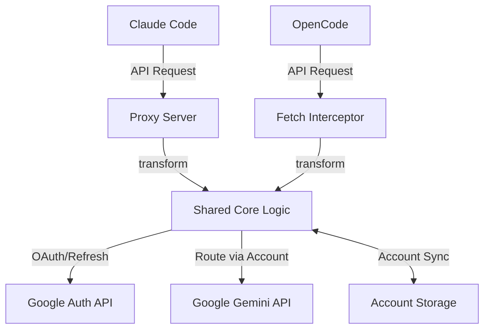

# antigravity-auth

Google Antigravity OAuth plugin for OpenCode and Claude Code. Intercepts `fetch()` calls to `generativelanguage.googleapis.com`, transforms them to Antigravity format, and handles auth, quota, recovery, and multi-account rotation.

## Architecture

## Structure

- `src/` - Shared core logic (API transforms, OAuth flows, account management)
- `claude/` - Claude Code specific wrappers (standalone proxy server)
- `opencode/` - OpenCode specific wrappers (fetch interception plugin)
- `dist/` - Single compiled output supporting both environments

## License

MIT
